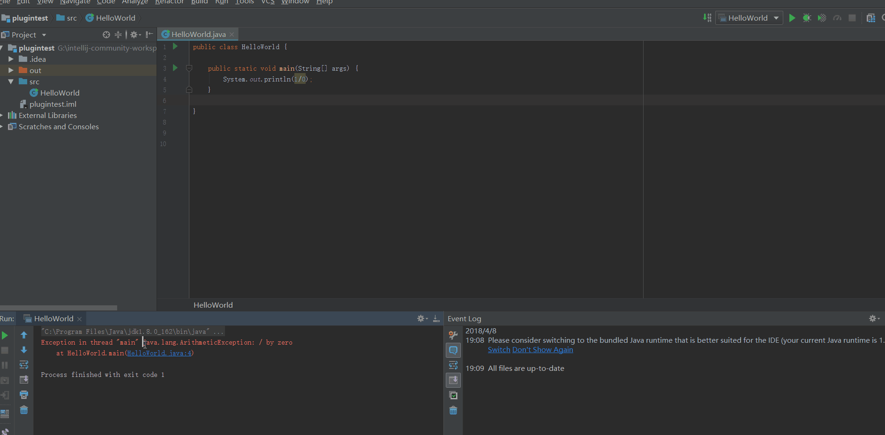

# SearchByBaidu

Intellij IDEA 插件，选中文本，使用Baidu搜索。

## 如何安装

- 可以直接下载SearchByBaudu.jar 然后导入插件。
- 或者在Intellij IDEA 插件仓库搜索 SearchByBaidu 来进行安装

## 如何使用

或者

选中文本按住快捷键(ctrl+alt+1)即可跳转。

## LICENSE

MIT LICENSE

## Release Version
- 1.0 原型
- 1.0.1 添加快捷键 <- current version